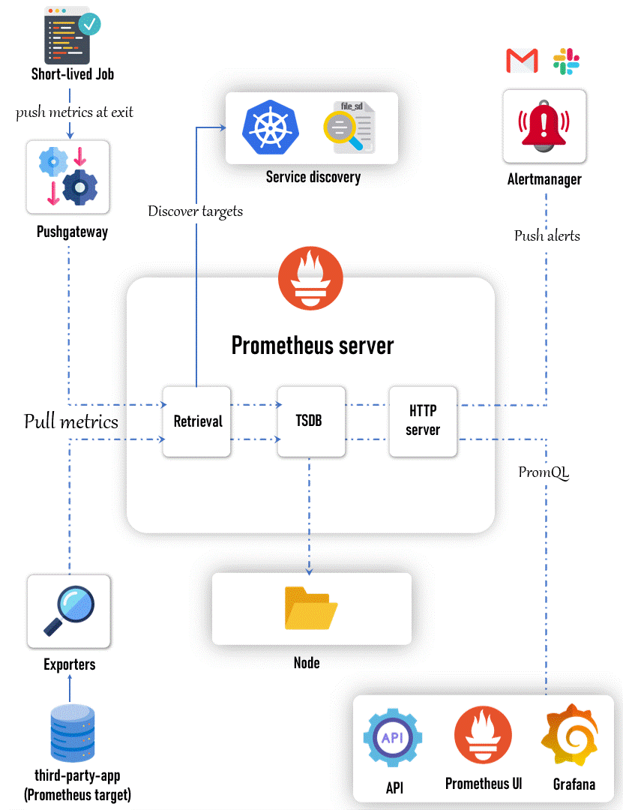

# Monitoring

# Metrics vs Monitoring

Metrics are measurements or data points that tell you what is happening. For example, the number of steps you walk each day, your heart rate, or the temperature outside—these are all metrics.

Monitoring is the process of keeping an eye on these metrics over time to understand what’s normal, identify changes, and detect problems. It's like watching your step count daily to see if you're meeting your fitness goal or checking your heart rate to make sure it's in a healthy range.

# Prometheus

=> Prometheus is an open-source systems monitoring and alerting toolkit originally built at SoundCloud.
=> It is known for its robust data model, powerful query language (PromQL), and the ability to generate alerts based on the collected time-series data.
=> It can be configured and set up on both bare-metal servers and container environments like Kubernetes.

# Prometheus Architecture

=> The architecture of Prometheus is designed to be highly flexible, scalable, and modular.
=> It consists of several core components, each responsible for a specific aspect of the monitoring process.

